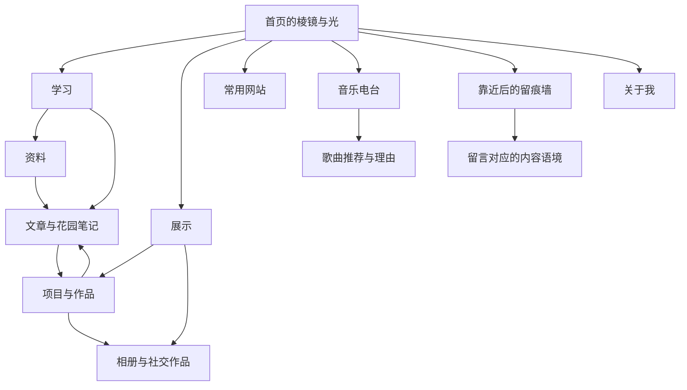

# 个人主页整体页面与交互设计

文档对应（2026-10-07 整理）：本文件为设计侧 `SPEC.md`，对应[技术侧规格](../technical/SPEC.md)。页面与需求、设计任务、工程任务的统一映射见[文档对应表](../README.md)。

本文供页面设计、素材选择和前端实现使用。设计顺序为：确定分页与功能，定义各页 UI/UX，梳理页面关系，再据此设计转场与整体概念表达。页面和功能以用户需求为依据，组件与素材优先复用、配置和改造现成优质资源。

更新日期：2026-10-07。状态：整体设计初稿，供后续原型和实现验证。四组功能入口、黑色首页、棱镜控制靠近白色留痕墙的方向已由用户提出；本文的页面布局、细节参数和改造方式属于设计建议。技术基线见[技术方案](../technical/SPEC.md)，候选与来源见[设计复用与素材来源](REFERENCES.md)。

2026-10-07 用户调整：取消 P07 知识关系图，学习总览 P03 作为统一浏览入口，通过主题、类型、搜索和内容详情中的普通引用继续阅读。取消对应图谱入口与控件，其他页面编号沿用。

2026-10-07 用户再次调整：取消 P04 课程与学习路线详情页。学习总览直接展示资料、文章和笔记；科目名称可作为主题标签，不另建课程条目、先修关系或学习顺序。P04 编号停用，其他编号沿用。

2026-10-08 T02.01 局部接入：G01“全站目录”包含学习、展示、常用网站、音乐电台、关于我、留言墙六个稳定入口。主站页头与学习区站名旁复用同一控件；首页和 404 不标记栏目，栏目首页标“当前页”，子页标“当前栏目”。该目录负责跨栏目，学习侧栏负责科目/条目，正文目录负责当前内容锚点，三者范围清楚。

展开层是非模态目录，可用 Tab/Enter/Space 操作；再次触发可收起。启用脚本时，G05“关闭目录”或 Esc 收起并恢复触发焦点，外部点击或焦点离开时收起并尊重用户选择的目标。无脚本仍通过原生展开控件访问及关闭。手机原生学习菜单仍独立可用。最新首页固定入口与滚动章节在设计工作区维护；全站目录的四类功能归属沿用，本轮不等同首页场景或品牌视觉完成。[实例证据](iterations/u13-g01-t02-01-2026-10-08-01.md)。

## 使用入口与文档分工

本文是页面与功能的主清单，现有 16 个页面或界面目标，编号用于施工与验收；搜索优先复用搜索层，管理能力优先沿用现成后台。详细概念和场景状态维护在[概念施工说明](CONCEPT.md)；共用参数维护在[设计规范](SYSTEM.md)；每轮任务、控件卡与验证方法维护在[UI/UX 工作流](PLAN.md)。后续实施先选页面和用户任务，再按这三份文档制作最小样本。

- [分页与功能](#一-分页与功能)：页面、地址、职责与状态。
- [各页 UI/UX](#二-根据功能定义各页-ui-和-ux)：页面如何组成、如何操作。
- [页面关系](#三-页面之间的逻辑关系)与[交互](#四-根据页面关系定义交互)：如何继续浏览及恢复状态。
- [复用](#六-复用与改造策略)、[素材](#七-图片与其他素材)与[验收](#九-验证顺序与交付标准)：采用边界和完整旅程。

## 一 分页与功能

### 内容分组

首页通过光的落点组织四组主入口。四组是功能归属，栏目内部的筛选和视图继续使用清楚的中文名称。

| 主入口 | 包含内容 | 访客的主要任务 |
| --- | --- | --- |
| 学习 | 知识库、PDF 与外链资料、博客、数字花园笔记 | 找到学习内容，阅读并沿引用继续探索 |
| 展示 | 项目、作品、照片、相册、B站与小红书作品 | 浏览成果，了解过程，观看影像 |
| 常用网站 | 分类网址、工具与外部资源入口 | 快速找到并打开一个网站 |
| 音乐电台 | 歌曲、精选与共享歌单、推荐理由、访客推歌 | 收听、了解分享原因、推荐歌曲 |

身份资料通过个人标识进入；留言墙（概念文档中的“留痕墙”，P14）通过首页中央棱镜以及全局目录进入。二者不增加四个光路入口的数量。全局目录包含所有主要页面，方便日常使用和直接访问。

### 页面清单

下列路径表达信息结构。已选插件有原生路径时优先沿用，并保持同一模块的统一入口与规范地址。`/showcase/` 已有实际待配置路由，尚未接入展示内容；各页真实进度见[技术计划](../technical/PLAN.md)。站内部署使用项目 base 前缀。

| 页面 | 地址或归属 | 必须具备的功能 | 页面性质 |
| --- | --- | --- | --- |
| P01 首页 | `/` | 身份辨识、四组入口、棱镜与留痕墙入口、目录、搜索、声音开关 | 独立入口页，含空间状态 |
| P02 关于我 | `/about/` | 身份、介绍、经历、能力、联系、简历入口 | 独立页 |
| P03 学习总览 | `/knowledge/` | 统一检索、主题浏览、类型筛选、资料、文章与笔记入口 | 同一知识库的总览页 |
| P05 资料详情 | 知识库原生详情路径 | 来源、类型、简介、文件信息、预览或原站链接、关联内容 | 知识详情模板 |
| P06 博客或花园笔记 | 知识库原生详情路径 | 正文、目录、标签、日期、引用与被引用、更新或生长状态 | 共享阅读基础的详情模板 |
| P08 展示总览 | 建议 `/showcase/` | 聚合项目、作品、照片与社交作品，分类和筛选 | 独立聚合页 |
| P09 项目或作品详情 | `/projects/` 及原生详情路径 | 介绍、角色、过程、成果、媒体、相关知识和外部链接 | 独立内容详情 |
| P10 相册 | `/gallery/` 及相册路径 | 照片排列、说明、单图浏览、前后切换 | 独立相册页，单图可展开 |
| P11 社交作品详情 | 展示区内的条目路径 | 封面、标题、说明、平台、原站链接；可用时内嵌播放 | 按内容深度选择站内详情或直接外链 |
| P12 常用网站 | `/links/` | 分类、搜索、用途说明、外部跳转 | 独立工具页 |
| P13 音乐电台 | `/music/` | 歌曲展示、歌单切换、播放或原站入口、推荐理由、推歌 | 独立页，列表与表单为页内状态 |
| P14 留言墙 | `/guestbook/` | 留痕浏览、单条展开、登录、留言与回复、原讨论入口 | 独立页，兼容首页空间进入 |
| P15 搜索结果 | 复用现成搜索；需要分享结果时配置结果地址 | 搜索词、结果类型、摘要、无结果提示、到达内容 | 搜索层与可恢复的结果状态 |
| P16 页面不存在 | 站点 404 | 清楚说明、首页与目录入口、搜索 | 独立状态页 |
| P17 内容管理 | Pages CMS 托管入口 | 网页编辑、上传、草稿、发布与预览 | 管理者使用现成后台 |
| P18 推歌审核 | 所选管理服务入口 | 查看推荐、通过或拒绝、同步状态、重试和授权处理 | 独立管理能力，平台待选 |

AI 问答、简历与年度总结为未来能力。问答预留在知识查询场景；简历与总结预留在管理工作流。接入前不把它们显示成可用功能。

### 页内状态与分页规则

- 类型、主题、标签、排序与关键词通过筛选改变同一列表；需要分享和返回时保存到地址中。
- 博客与笔记仍属于学习区，不另建数据孤立的博客站和花园站。
- 展示总览聚合照片和项目；相册与项目详情保留适合各自内容的结构。
- 图片放大、单条留言展开、菜单和推歌表单属于局部展开状态；长篇项目与知识正文有独立地址。
- 长列表优先复用有明确前后页或“加载更多”的成熟分页方式。保留当前位置，不采用无法回到原条目的无限漫游。
- 内容详情、相册和留言墙可以被直接访问。没有来路时，返回控件显示其所属栏目。

## 二 根据功能定义各页 UI 和 UX

### P01 首页

**任务：**让访客认出网站的主人，发现四组内容，并理解棱镜可以带自己走近留言墙。

**组成：**黑色空间、淡淡的砖墙轮廓、中央棱镜、四个光路落点。默认方位为左上学习、右上展示、左下常用网站、右下音乐电台；窄屏按相同内容顺序重排。身份名称位于稳定位置，目录、搜索与声音控制使用少量明确按钮。

**行为：**光路引导空间入口的名称显露，显露后保留短标签；独立的文字目录从首屏即可使用。聚焦或悬停显示下级内容与少量预览。落点和文字共同构成点击区域。点击主入口直接进入对应栏目；点击中央棱镜启用通向留痕墙的距离控制。提示语分别说明“进入学习”等目的地和“走近留言墙”的动作。

**状态：**加载时先显示姓名、文字入口和静态场景；图形可用后接入光效。图形失败时仍能访问全部内容。返回首页恢复入口与空间状态，完整入场动画只用于访客主动重看。

**复用：**借鉴 Unseen 的空间导航组织，优先验证现成棱镜材质、光效与输入控制。需要补充的部分是四组内容落点和靠近墙面的编排。来源及具体缺口见[复用清单](REFERENCES.md)。

### P03 学习总览

T07.04 本轮目标：在现有筛选后增加原生“排序”下拉菜单，提供按主题（默认）、标题升序和标题降序。升/降序采用中文名称与章节数字的自然顺序；同名条目顺序可重复，重复标题仍为独立条目。排序不会重置类型、主题或当前控件焦点；数量反馈同时说明所选排序。清空筛选保留排序；切回默认排序恢复原主题分组顺序。地址可复制，详情返回恢复排序、原位置和条目焦点。无脚本明确说明筛选/排序不可用，全部条目仍可读。

2026-10-08 T07.02 局部接入：K01 增加原生“主题”单选菜单，默认全部主题；与已有类型取交集。多主题条目可在每个所属主题看到，选择“全部”类型仍保留主题，选择“全部主题”仍保留类型。K02 共用一条主题/类型/数量反馈，空结果保留条件；“清空筛选”同时恢复全部并将焦点放回可见的“全部”类型。未知条件回退对应字段并解释，其他参数和锚点保留。

原生学习侧栏继续负责条目导航，主题选择负责统一结果；公开主题不因类型选择消失，允许真实空组合。无脚本显示全部内容并说明筛选不可用。设计工作区第 3 轮的整体构图仍待独立 Astro 接入，本轮仅在现有工程上补主题操作，[控件与证据](iterations/u09-p03-t07-02-2026-10-08-01.md)不代表整页审美或用户确认。

**任务：**找到一份资料、一篇文章或笔记，并能继续读同主题或被引用的内容。

**组成：**顶部是清楚的知识搜索；其下为主题导航和类型筛选；主体直接显示资料、文章、笔记的统一结果。可按主题、标签和日期浏览，花园笔记可按生长状态筛选。

条目保留标题、类型、短说明、主题及必要日期；PDF 显示文件类型和大小，外链显示来源。不同类型使用细小标识，避免每一种类型都换一套卡片。

**行为：**筛选立即改变结果，并保留已选条件；清空筛选回到总览。进入条目后再返回，恢复查询、分页和滚动位置。结果为空时显示当前条件及可执行的调整动作。

**复用：**Starlight 的导航、搜索和阅读组件为基础，博客优先接入既定插件。采用配置、样式覆盖和局部扩展，保持全站相同的字体、光线标记与按钮规范。

### P05 资料详情与 PDF 阅读

2026-10-08 用户指出缩略图侧栏缺少就近关闭入口。T08.02 / K04-native：侧栏标题区提供可见“收起”按钮，关闭后将焦点交回原生工具栏开关，可再次打开；缩略图、目录和阅读页码继续由原生阅读器管理。手机、键盘、刷新和全屏阅读分别实测，其他界面参数沿用既有规范。

2026-10-08 T26.01 / P03、P05、P06：资料与 PDF 笔记也在阅读区前提供 G04 来源返回，沿用文章已有入口。返回恢复类型/主题及原列表位置，并将焦点交回实际进入的列表、正文、关联或侧栏链接；搜索返回原词与结果。直接打开时，资料/笔记回到对应类型的学习总览，文章回文章列表。阅读章节后仍可一次返回来处。外部笔记保持直达作者原站，浏览器后退负责本站返回。

PDF 页码/缩放复用阅读器实际持久历史，刷新或离开再回来恢复可用状态；新文件使用原生自动缩放。清除存储、换设备或换站点地址后不承诺保留。复用 K03/K04-native 与既有字体、颜色、焦点和触摸目标；用户体验与整页设计另验。

2026-10-07 最新验收要求：打开 PDF 条目即进入渲染阅读区；说明、文件信息和关联内容放在阅读区之后，可折叠查阅。不能先落到只有信息的页面再要求点击阅读。外部笔记条目直接跳转原站，保留无脚本可用的访问链接；正文型笔记沿用原生渲染。

**任务：**确认资料是否需要、打开阅读，并知道它来自哪里。

**组成：**标题、来源、简介、文件信息、阅读与下载动作、主题及关联文章和笔记。PDF 阅读区复用完整阅读器，提供其原生目录、翻页、缩放与搜索。外链资料显示用途说明和明确的原站入口。

**行为：**大文件采用主动打开和可感知的加载状态；预览失败后保留原文件或原站入口。阅读位置按阅读器实际支持方式保存。离开 PDF 前往笔记后，返回恢复可用的页码与缩放状态。触屏缩放由阅读器处理。

**状态：**区分“文件尚未加载”“加载失败”和“该扫描件暂不支持文字检索”。文件不存在时显示关联笔记或其他资源，保留清楚的返回入口。

**复用：**PDF.js 现成 viewer 或已经验证的完整组件。页面自身只补文件语境、资源入口和与知识库的联系。

### P06 博客与数字花园笔记

2026-10-08 T09.01 / P05–P06：正文后显示“关联内容”，每条为类型和真实标题组成的普通链接，使用已声明的关系，不推断学术引用或反向引用。PDF 的关联放在阅读区和可折叠说明之后，保持打开条目先看到 PDF；没有公开目标时不显示空关联区。外部笔记仍直接访问原站；仅为资料说明页提供同样的静态链接。长标题可换行、键盘焦点可见、无脚本可访问。

2026-10-08 T09.02 / P05–P06：同一区域在正向列表后提供“哪些内容关联了它”，每条仍为来源类型和真实标题，按标题排列；只有明确声明且公开的来源才出现。无来源时隐藏整段。两个列表各有唯一标题和导航名称；复用 K03 行样式、苹方优先字体、明暗语义颜色和焦点。PDF 仍先呈现阅读区；外部笔记继续直达原站。无需图标、插画或动效；不把业务关联称为已核实的学术引用。

2026-10-08 T07.03：文章列表每页 5 篇，复用原生“较新的文章／较早的文章”翻页链接和稳定页面地址，第一页无较新入口、末页无较早入口；标签页标题与计数说明当前标签，集中列出该标签的已发布文章。由标签列表进入正文后，返回入口明确命名“返回标签结果”，并恢复该标签地址、位置与焦点。三页边界使用仅本机的功能验证内容，不增加正式文章或新的视觉资源。

2026-10-08 T09.03 首轮阅读样本：一篇标明“功能验证样稿”的文章，文章列表、学习总览的文章筛选及搜索进入同一正文；沿用原生标题、日期、目录、代码与标签。正文前提供来源返回入口和学习总览链接：有来路时返回原列表或原搜索结果，恢复阅读前的条件、位置与合理焦点；直接访问时提供文章列表入口。文章可以直接阅读，返回不依赖先走首页。参考阅读来源保持普通链接。

**任务：**持续阅读一个想法，并找到它引用或影响的其他内容。

**组成：**标题、类型、必要日期、正文、目录，以及真实存在的引用和反向引用。文章强调完整叙述；笔记可显示“萌芽、整理中、相对完整”等编辑状态。编辑状态与是否公开分开管理。

**行为：**正文使用稳定的平面排版和原生滚动。代码、公式、链接、复制、章节定位复用成熟组件。关联内容提供类型和简短语境，帮助读者理解为何相连；引用和关联条目通过普通链接直接进入对应详情。

**主题表达：**阅读页边的一条细光线可以成为目录当前位置或关联提示。背景在阅读时静止，让联系通过内容本身成立。

**复用：**以 Starlight 和博客插件为基础，参考 Quartz 的反向引用体验；引用与关联信息使用原生链接和列表组件，支持键盘访问与返回。

### P08 展示总览

**任务：**快速发现感兴趣的成果，再选择深入了解过程或观看影像。

**组成：**一个统一的展示入口，类型筛选为“全部、项目与作品、照片、社交作品”；下方是由封面、标题和少量信息组成的画廊。默认布局采用有节奏的编辑式网格，突出少量精选内容，其他内容保持一致的可扫读结构。

**行为：**悬停或聚焦时封面轻微展开，显示一句摘要与类型；点击进入内容详情。筛选在当前页面完成并可恢复。探索型画廊如被采用，应与普通目录读取相同数据，并提供直接选择入口。

**复用：**先验证成熟图库与现有网格、链接组件；借鉴 CLOU 的内容关系组织和 Sculpting Harmony 的作品叙事。只有明确需要的空间浏览才采用额外三维效果。

### P09 项目与作品详情

**任务：**理解作品是什么、你做了什么，以及最终结果。

**组成：**标题和主视觉、目标与背景、个人角色、过程与关键取舍、成果、体验或源码链接、相关知识。个人角色与团队信息使用真实内容。B站或小红书作品若具有完整说明，可以沿用这套模板；简单分享条目可以直接进入原站。

**行为：**从封面进入时，封面或边框延续到详情首屏。长内容用目录与章节锚点；媒体使用成熟查看器。链接到学习笔记时给出“相关实现笔记”等关系说明，返回保留项目章节位置。

**复用：**使用现有内容组件、图库与媒体组件；以主创案例中的“背景、过程、结果”组织法构成叙事。新增工作集中在个人项目内容和必要的共享元素转场。

### P10–P11 相册、照片与社交作品

**任务：**观看照片、了解语境，并轻松在照片之间切换。

**组成：**相册名称、简短说明、照片序列；照片展开后显示图片、说明、前后切换和关闭。地点与拍摄信息仅在内容明确允许展示时呈现。

**行为：**复用 PhotoSwipe 的缩略图展开、缩放和触摸体验。关闭回到对应缩略图，保持列表位置。为单张照片提供可分享的定位方式；直接访问时可回到相册。横竖照片保留原始比例，封面裁切单独配置焦点。

**状态：**图片加载中保持尺寸；失败时保留说明及重试或原图入口。图片较少时使用简单排列；缺少真实照片时展示明确空态或演示标识。

**复用：**PhotoSwipe 及 Astro 图片处理，改造工具栏、背景和说明文字。素材优先使用用户自己的照片。

### P12 常用网站

**任务：**用尽量少的步骤找到需要的网站并离开本站。

**组成：**搜索、分类导航、紧凑链接条目。每条包含名称、用途、所属分类和可辨认的域名；图标加载失败不影响文字入口。

**行为：**分类切换保留搜索条件；明确标注外部跳转。外链默认新标签打开并提供对应提示，原列表位置保留。所有入口直接可点击，光线仅辅助当前焦点。

**复用：**参考并按许可改造 WebStack 的分类与条目结构，沿用本站组件与样式。既有网站名单由后台维护，不自动抓取访客浏览历史。

### P13 音乐电台

**任务：**听到一首歌、读到推荐原因，并有机会分享自己的歌曲。

**组成：**当前歌曲与封面、推荐理由、播放控制或原站入口、歌单列表、共享歌单说明、推歌入口。调台式交互对应实际歌单或歌曲选择；播放进度始终表达真实音频时长。

**行为：**由用户主动开始播放。站内可播放的音源在切页时保持一个播放器实例；外部嵌入的连续性以实测能力为准。展开完整播放器、收起到迷你播放器、暂停和静音均有固定入口。页面音效与歌曲播放协调，避免叠加干扰。

**推歌：**表单包含昵称、网易云歌曲链接或 ID、推荐理由。提交前校验；失败保留输入；成功后显示回执及“待审核”。审核通过后区分“待同步、已加入歌单、同步异常”。普通访客得到清楚状态，管理员在后台处理重试与授权。未经审核的记录不进入公开歌单。

**复用：**先验证 APlayer 或实际可用的官方播放渠道；表单和反馈复用成熟组件。网易云自动同步继续作为必须完成的独立业务能力，不能由播放器外观代替。

### P14 留言墙

**任务：**读到别人留下的表达，打开完整内容，并留下或回复一段话。

**组成：**正面的暖灰白砖墙、代表真实留言的砖块、单条展开、留言和回复入口，以及普通列表视图。墙上显示短摘录和作者，完整内容在展开层阅读。砖块的位置根据稳定标识保持稳定，分页或筛选不会随意洗牌。

**行为：**从首页靠近进入时，砖块从纹理变成可操作条目。直接打开留言页则进入可读状态。点击砖块，边界扩展成阅读区域；关闭恢复原砖和焦点。移动端可使用宽度稳定的列表，保留砖缝和留痕的视觉联系。

**接入边界：**当前采用 Giscus 和 GitHub Discussions。常规留言需要 GitHub 身份且直接公开；提交和回复优先使用其原生界面。自定义砖墙如采用公开讨论快照，应说明更新时间，提交成功与墙面刷新分别反馈。提供原讨论定位入口；其站内精确定位能力需接入时验证。

**状态：**未登录时说明登录动作；无留言时保留邀请；第三方暂不可达时可继续读已有快照并打开原讨论。普通留言与推歌审核分别处理。

**复用：**Giscus 原生提交和管理、现成对话框与列表组件。最小新增部分是砖的位置布局、与讨论条目的映射，以及砖与阅读层之间的展开。

### P02、P15 关于我和全局搜索

关于页采用可读的编辑式排版：姓名与简介、经历、能力、精选项目、联系与简历。它可以从首页个人标识、项目署名和全局目录进入。简历文件只有实际存在时才提供下载，未来生成能力放在管理端。

搜索在各内容页保持相同入口。学习区默认使用知识搜索，明确范围；若全站统一索引已验证，可增加学习、展示、网站等范围选择。结果显示标题、类型和摘要。空结果给出清除过滤、修改关键词等动作。搜索关闭回到触发位置，进入结果后返回恢复查询。

### P16 页面不存在

**任务：**让访客明白地址无效或内容已移动，并能继续访问其他内容。

**组成：**一句清楚的说明、首页与全局目录入口、搜索。不使用整屏动画或需要等待的场景。

**行为：**直接返回首页不重放开场；从站内失效链接进入时说明所属栏目并保留返回入口；原地址有对应内容时给出新地址。

### P17–P18 管理页面与未来 AI

2026-10-09 T13.04：P17 增加原生“文章”列表及新建入口，仍使用已有目录和中文字段。新文章默认草稿，标题、摘要、日期、主题/标签及正文可编辑；新建时填写英文地址标识，字段说明要求保存后保持，修改标题不自动改变已保存地址。原生 UUID 字段会拒绝已有语义标识，因此沿用既有格式，禁止后台重命名，不迁移旧文章。首次只核验新建与再打开，不改既有学习排版或另建后台；真实保存及生产排除结果单独记录。

2026-10-08 T13.03 单篇发布状态：沿用原生“草稿”开关，开启时不生成生产文章页面；关闭表示提交发布候选，保存后先构建，PR 合并及部署成功后才是正式上线。字段说明直接说明各状态，不增设假发布成功提示或自定义后台。同一篇测试文章已通过真实托管三次保存及独立本机生产预览，验证首次可见、修改同步与回草稿排除；最终原文和草稿已恢复。正式部署另验。[真实局部记录](iterations/u13-p06-t13-03-hosted-2026-10-08-01.md)。

2026-10-08 T13.02 / P17 正文插图：同一固定草稿开放原生媒体库和正文图片上传，保留中文说明、原生图片替代文本入口及 Source 备用修改方式；图下说明作为正文。上传图片与保存正文分别提示，公开仓库上传立即可读，草稿状态不能隐藏图片文件。原生 Astro 开发页面用于阅读预览，生产继续排除草稿正文。沿用当前学习区字体、正文宽度和原生图片尺寸，不新增封面裁切或编辑后台。配置/本地样本及单张 PNG 的真实媒体库上传、Source 填 alt/说明、Editor 预览、保存刷新已验；原生 alt 弹窗和取消/失败状态另验。

2026-10-08 T13.01 单篇样本：管理入口沿用 Pages CMS 官方界面，先只开放“文章草稿验证”。标题、摘要、日期、主题、标签和正文有中文标签；正文使用原生富文本/Markdown Source 切换，图片上传留下一轮。显示只读开启的草稿状态与“保存不会发布”的说明，固定文件名和内容类型不进入普通编辑流程。保存、未保存修改、校验错误、取消/离开提示与历史沿用原生能力，是否实际可用逐项实测；未授权时只说明登录与仓库接入，不能显示保存成功。

内容编辑沿用 Pages CMS 的成熟界面。按学习、展示、网站、电台及个人资料配置字段与媒体；上传图片需要说明、替代文本和必要裁切信息。草稿、保存、构建、发布是不同状态；只在实际发布完成后显示可访问结果。

推歌审核使用所选管理服务的现成列表、筛选、详情与操作。每条记录呈现歌曲、理由、审核状态和同步状态；重复提交、写入失败、授权失效均能被识别和处理。

未来知识问答显示答案及可打开的来源；无法从公开内容确认时给出不确定性。简历和年度总结先生成可编辑草稿，再由管理者确认导出或发布。本站不单独设计一套与现成后台重复的管理系统。

## 三 页面之间的逻辑关系

### 内容关系

全站内容围绕“接收、理解、表达、回应”相互连接。关联由真实引用、分类或编辑配置产生，不使用装饰性连线冒充关系。

| 关系 | 页面如何体现 | 用户为什么会继续访问 |
| --- | --- | --- |
| 同主题内容归类 | 学习总览按主题列出资料、文章与笔记，详情保留主题标签 | 找到同一主题的其他内容 |
| 资料被笔记引用 | 资料详情显示相关笔记；笔记注明来源 | 从阅读材料到个人理解 |
| 笔记支持项目 | 项目链接实现笔记；知识详情链接相关作品 | 从学习到实践 |
| 项目包含影像 | 项目内引用相册或作品媒体 | 从结果到具体观看 |
| 网站辅助学习或创作 | 有真实关联时，文章、笔记或项目列出所用工具 | 从理解到继续行动 |
| 歌曲与推荐理由相连 | 每条推荐保留推荐者与理由 | 从收听到交流 |
| 留言回应一段内容 | 留言可带来源页面的标题与链接 | 从表达回到具体语境 |
| 个人资料关联精选作品 | 关于页指向代表项目，作品指明个人角色 | 了解作品背后的人 |

### 导航关系

全局目录按四组主内容、关于我和留言墙组织。场景入口、目录与搜索结果指向相同地址。文章目录只负责当前正文，学习侧栏只负责知识组织，两者与全局目录使用不同标题，避免范围混淆。

栏目内可以通过列表与关联连续阅读。跨栏目通过明确的关系链接或全局目录直接到达。浏览器前进后退、直接链接和刷新均保留标准行为；空间转场作为这些访问方式的视觉延续。

## 四 根据页面关系定义交互

### 转场规则

| 来路与去向 | 关系 | 主要视觉动作 | 到达和返回的规则 |
| --- | --- | --- | --- |
| 首页到四组主入口 | 选择内容方向 | 被选光路显露，落点扩展为目的页的标题边界或主内容面 | 写入真实目的地址；返回恢复原落点，不重复入场 |
| 首页到留痕墙 | 从远处靠近他人的表达 | 墙逐渐向前，受光区域扩大，砖缝和留痕变清楚 | 到达后进入留言页；途中取消回到首页 |
| 列表到知识详情 | 从摘要到完整内容 | 标题、细线或容器边缘延续为阅读界面 | 正文及时可读；返回恢复查询、分页和滚动 |
| 封面到项目详情 | 从成果片段到过程 | 同一封面展开，随后出现正文 | 没有可匹配封面时采用短转场；不等待大图全部加载 |
| 缩略图到大图 | 放大当前对象 | 复用图库的原生展开和缩放 | 关闭回原缩略图；键盘焦点恢复 |
| 留言砖到完整留言 | 读到一个人的完整话语 | 砖的边界展开，背景退后或降低强调 | 关闭回原砖；原讨论入口保持可用 |
| 知识到项目或其他关联内容 | 从一个依据到它的关联对象 | 关系标记短暂显露，共享标题或边界接续 | 直接到达目标；返回保留阅读位置 |
| 同组内容前后切换 | 在同一集合中移动 | 小幅横向接续或现成组件转场 | 集合、筛选和顺序不变 |
| 搜索结果到内容 | 从查找到阅读 | 轻量转场，清楚呈现标题 | 以快速到达为主；返回保留搜索词 |
| 推歌提交到回执 | 从编辑到已接收 | 表单区域显示确认与真实状态 | 失败保留输入；成功后可以回到歌单 |
| 目录直接跳到任意页 | 主动改变目的地 | 短转场并保持全局标识连续 | 不绕行其他栏目；焦点进入目标主要内容 |

同一时刻只安排一个主运动，其余变化辅助理解。关闭弹层、切换筛选、下载文件等局部操作使用局部反馈，完整空间运动用于明确的场景变化。

### 棱镜与白墙的状态

从远处、选中棱镜、靠近途中到可读白墙，使用同一个距离进度。主动激活后才处理场景滚轮；到达释放输入；留言阅读保持普通滚动。直接访问留言页无需重放开场。

完整状态 S0–S5、五个关键帧、文字蒙版、焦点与历史规则统一维护在[概念施工说明第 5 节](CONCEPT.md)。制作时按[工作流](PLAN.md)逐项验证几何、受光、控制和真实路由。

### 状态保留

| 位置 | 应保留的状态 | 恢复范围 |
| --- | --- | --- |
| 首页 | 当前落点、是否已看过引导、场景距离 | 本次访问的返回；允许主动重置 |
| 学习列表 | 搜索词、主题、类型、排序、页码、滚动位置 | 地址与浏览历史 |
| 阅读页 | 章节位置；PDF 的可支持页码与缩放 | 返回时恢复；不可恢复时提供章节入口 |
| 展示总览 | 类型筛选、集合顺序、原封面位置 | 返回总览 |
| 相册 | 当前照片、原缩略图位置、打开与关闭状态 | 相册内导航与返回 |
| 音乐 | 实际歌曲、播放或暂停、音量、进度 | 可用音源和播放器支持的站内切页 |
| 留言墙 | 列表页码或范围、选中留言与原砖位置 | 展开、关闭与返回 |
| 表单 | 未提交内容、校验结果、提交回执 | 当前操作与可控的失败重试；敏感信息不进入地址 |

单图或单条留言需要分享定位时，使用稳定标识对应地址状态。打开层的前进后退行为与其 URL 同步；关闭直接访问的内容时，有明确的所属页面作为去向。

### 控件与主题的关系

| 控件 | 外观和主题联系 | 行为约定 |
| --- | --- | --- |
| 主入口 | 光路落点、短标签、可选内容预览 | 标题与落点共同可点击；焦点与悬停给出相同信息 |
| 中央棱镜 | 空间中的独立物体 | 有明确的走近留言墙提示；激活后切换控制状态 |
| 分类和标签 | 与标题和细光线采用一致的边界语言 | 当前项有文字或形状区别，不能只靠颜色 |
| 下载和外链 | 简洁文字与通用图标 | 明确说明动作、目的地或文件；反馈在原位置出现 |
| 播放控制 | 细线、刻度与实际播放状态 | 标准播放、暂停、音量、时长；装饰不改变其含义 |
| 提交和重试 | 清楚的主操作按钮 | 忙碌时防重复提交；成功或失败说明实际结果 |
| 返回和关闭 | 固定的来路提示或标准关闭入口 | 返回页面与关闭展开层分别命名；恢复焦点和位置 |
| 目录与搜索 | 全站稳定的文字或图标入口 | 可从任何内容页到达；装饰层不遮挡点击和焦点 |

## 五 整体主题与视觉表达

主题工作名“彼此之间”：从远处看见一个人的方向，沿学习、作品与声音了解他，再留下回应。接收、理解、表达、回应通过真实内容关系连接。

黑色首页与白色留痕墙共享同一面墙。迷幻通过折射与显影、辽阔通过留白与尺度、温柔通过柔边与可控的运动表达。学习页的光成为目录和引用标记，展示页由真实作品主导，电台和留痕承接具体的人与声音。

完整的概念规则 C01–C07、页面场景定义、光与蒙版、动作 TX01–TX06 和控件施工目录见[概念施工说明](CONCEPT.md)。颜色、字体与运动参数以[设计规范](SYSTEM.md)为唯一维护位置；本节保留主题摘要。

## 六 复用与改造策略

### 默认顺序

1. 寻找能够完整完成该页主要任务的成熟方案。
2. 用配置、主题变量和原生扩展接入本站。
3. 选取需要的组件或有明确许可的示例，保留成熟交互，统一外观。
4. 根据已验证的缺口做局部改造或二创。
5. 现成方案与改造均不能满足需求时，原创最小必要部分。

设计案例用于学习组织与运动方法，可复用代码和素材则按各自许可处理。采用的每个模块都应说明“来自哪里、保留什么、改变什么、为何需要改变、怎样验证”。详细来源见[设计复用与素材来源](REFERENCES.md)。

### 各模块的默认取舍

| 模块 | 优先保留 | 统一改造 | 可能需要补充的最小部分 |
| --- | --- | --- | --- |
| 学习 | Starlight 及既定博客、搜索能力 | 字体、颜色、间距、全局入口和关联样式 | 跨知识类型的聚合、插件尚未覆盖的引用语境 |
| 资料阅读 | 现成 PDF 阅读器 | 外层资料说明与本站来路 | 资源映射、状态保留适配 |
| 展示与相册 | 成熟图像查看器与现有内容组件 | 封面排列、工具栏、说明和转场起点 | 展示聚合、内容关系和可分享定位 |
| 常用网站 | 已有导航条目和分类组织 | 统一密度、图标、字色与焦点 | 与本站内容数据的绑定 |
| 音乐 | 成熟播放器、表单及状态组件 | 电台布局、推荐理由、播放器收起方式 | 审核、网易云写入与真实结果衔接 |
| 留言 | Giscus 提交、回复、登录和管理 | 支持范围内的主题配置 | 公开内容到砖面的映射及展开 |
| 首页场景 | 现成材质、光效、输入与转场工具 | 参数、造型、位置、颜色和运动规则 | 四个落点、共享距离状态、与真实路由的衔接 |
| 管理 | 现成 CMS 与所选管理工具 | 字段、分组、操作入口 | 平台未覆盖的音乐业务动作 |

React Bits 的 Prism 源码与 Light Rays、Drei 的透射材质均已列为研究候选。Prism 当前形体与我们需要的三棱镜存在差别，应先比较改造成本。优先验证一个统一场景，控制其光源、墙体和交互状态；选择效果库时同步考虑渲染资源复用与生命周期。

每个功能保留一个负责基础行为的主方案。图库、播放器、阅读器的原生操作优先成立，再添加主题表达。框架或插件已有的列表、弹层和表单能力优先使用；缺口出现后再引入额外组件。

### 自研或二创前的记录

记录候选名称、具体需求、未覆盖的行为、配置和改造尝试、最终最小范围。例如，“已有材质可以呈现透射，但四个光路需要准确对应 DOM 入口”，新增范围应限定为入口位置映射与光路编排。不得仅以风格不够独特为由重写已经可用的阅读或播放能力。

## 七 图片与其他素材

素材选择与页面用途绑定：先确定内容和空间需要什么，再选择现有资源。白砖材质已有 ambientCG 和 Poly Haven 的具体候选；图标、字体、图库与氛围图片也列于[素材清单](REFERENCES.md)。

- 个人照片、项目截图、作品视频优先使用真实已有内容；外部素材不能被当作个人成果展示。
- 墙面、颗粒和环境光先试用许可明确的现成素材。按需做裁切、调色、简化与压缩，保留原始文件和修改记录。
- 每个封面单独配置焦点，适应横向卡片、竖向手机和详情首图；正文媒体保留合理比例。
- 原图与网页派生版本分开，按页面加载需要提供尺寸；大图、视频和大 PDF 采用主动打开或按需加载。
- 音乐、专辑封面、演出素材分别记录来源与可用方式。站内播放、原站跳转与共享歌单写入分别验收。
- 只有现有素材和合理改造仍无法达到造型、构图或交互要求时，才制作原创素材。

选用结果登记资源名、作者、来源、许可、用途、原始文件、派生文件、裁切和调色记录、替代文本及验证结果。当前仅建立候选清单，正式页面资产尚未定稿。

## 八 跨页面的基础规范

### 字体、颜色与尺度

统一采用[设计规范](SYSTEM.md)中的语义颜色、字体、尺寸、焦点、动画与选图规则。每个页面通过相同变量适配深浅表面；需要例外时在对应迭代记录注明原因及受影响范围。

### 通用状态

| 状态 | 界面要求 |
| --- | --- |
| 加载 | 保留结构和文字入口，局部标明正在加载的内容 |
| 空内容 | 说明尚无内容或当前筛选无结果，给出实际可执行的下一步 |
| 加载失败 | 保留已呈现内容，提供重试、原站或返回动作 |
| 未配置 | 在需要访问的功能处说明当前不可用；不伪造成功状态 |
| 操作成功 | 显示实际完成的动作；待审核、待同步继续明确区分 |
| 失效外链或不存在的内容 | 提供所属栏目、搜索和相关内容入口 |

### 手机和键盘

手机保留四组内容和棱镜入口，按触控可达范围调整方位。学习与网站列表使用纵向浏览；相册保留查看器原生手势，留言可切为可读的砖形列表。按钮有效点击范围沿用设计规范。

所有关键操作可用点击、触控和键盘完成。悬停信息同样能通过焦点或点击获得；展开层有清楚关闭入口，关闭后焦点回到触发对象。搜索、菜单、阅读器和表单使用其成熟组件的语义与焦点管理，视觉层不隐藏必要文字。

## 九 验证顺序与交付标准

采用[小步工作流](PLAN.md)：每轮一个主要变量，从选图、静态构图、单控件到单段运动逐步组合。主题在每轮用概念规则检查；下表是组合完成后的旅程验收，不要求一次完成整页或整站。

### 每个切片先验证功能结构

用现成组件和代表性内容完成页面线框与真实路径，验证四组入口、统一知识库、展示聚合、音乐和留言的完整去向。检查每个功能属于哪个页面、需要什么数据、成功失败如何反馈，再调整细节外观。

### 页面局部通过后验证三条完整旅程

| 旅程 | 必须完成的操作 | 验收关注点 |
| --- | --- | --- |
| 学习与创作 | 首页到学习总览、资料、笔记、关联项目，再返回 | 统一归属、关系真实、阅读可用、状态恢复 |
| 观看与交流 | 展示总览到相册或项目，再进入带语境的留言 | 图片查看、深层地址、留言来源和关闭返回 |
| 收听与留痕 | 电台选歌或推歌；首页选棱镜、靠近墙、展开留言 | 音源真实状态、审核与同步区分、空间控制的进入和释放 |

### 主题与动效逐轮验证

- 四组入口能在黑色首页被发现，文字不依赖等待动画才能读取。
- 黑色到白色的中间状态保留墙的连续性、文字对比和退出方式。
- 每个主要转场对应接近、展开、关联、回应或返回中的明确关系。
- 页面直接访问、浏览器返回和搜索到达都能成立，不要求先经历首页。
- 手机、键盘、减少动画和图形降级时保留完整功能。
- 真实内容和示例可辨认；发表、播放、同步、AI 状态与实际接入一致。
- 对所采用现成方案记录版本、许可、保留能力、改造点与验证结果。

### 已有试作的定位

会话中已有“一根线与回声”和“黑色棱镜与白色留痕墙”试作。前者用于早期概念探索，后者用于观察分组、黑白层次与靠近过程。它们不代表正式站点的组件选型、最终排版或真实功能完成；正式设计按本文先分页与功能、再选择复用方案的顺序推进。

### 尚需通过后续原型确定

具体棱镜造型与材质、首页落点间距、墙面贴图的最终选择、展示网格节奏、标题字体和声音素材，需要结合实际内容与设备表现决定。姓名、个人资料、正式照片和项目清单在内容接入时补齐。这些事项不阻止当前页面结构和复用验证。

## 十 功能覆盖与文档衔接

| 技术需求 | 本设计中的归属 |
| --- | --- |
| R01 身份和资料 | 首页身份、关于我、项目署名与联系 |
| R02 R09 R10 学习资料 数字花园 博客 | 统一学习总览、资料、文章、笔记与普通引用链接 |
| R03 常用网站 | 网站分类、搜索与外链 |
| R04 音乐 | 电台、歌曲、歌单、推歌及审核同步状态 |
| R05 R06 R07 社交作品 照片 项目 | 展示聚合、项目详情、相册及原站入口 |
| R08 留言 | 留痕墙、Giscus、单条展开与回复 |
| R11 AI 预留 | 知识查询与管理端简历、总结工作流 |
| R12 前端运行和交互 | 路由关系、转场、状态恢复、手机与降级 |
| R13 内容管理 | Pages CMS、上传、草稿、预览与发布反馈 |

页面功能、内容关系和通用状态维护在本文；场景与动作维护在[概念施工说明](CONCEPT.md)，参数维护在[设计规范](SYSTEM.md)，迭代和证据维护在[工作流](PLAN.md)；组件、素材和案例来源维护在[设计复用与素材来源](REFERENCES.md)；架构、数据、接口和部署维护在[技术方案](../technical/SPEC.md)；实际工程状态维护在[技术实施计划](../technical/PLAN.md)。修改用户需求时同步受影响部分，始终区分设计完成、原型验证和正式实现。
