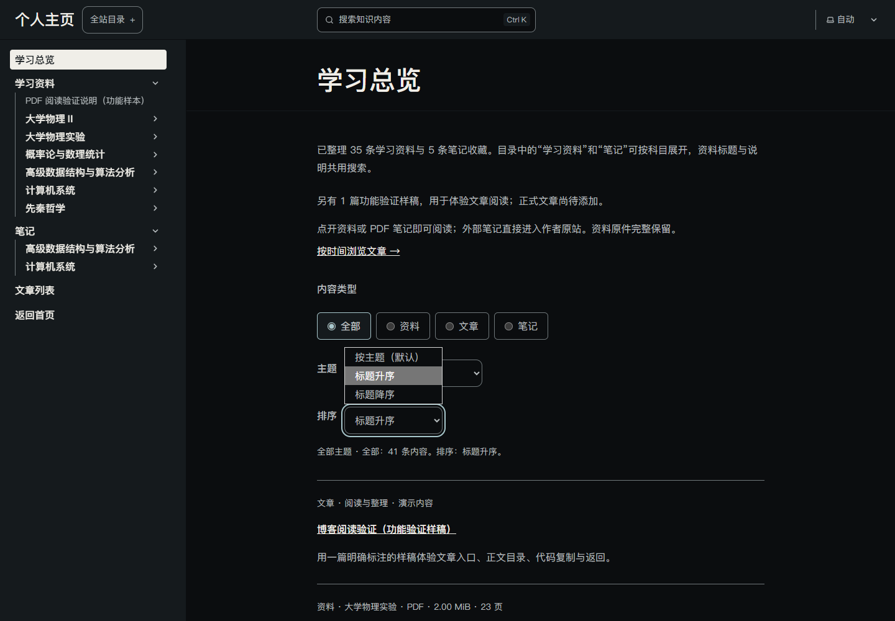
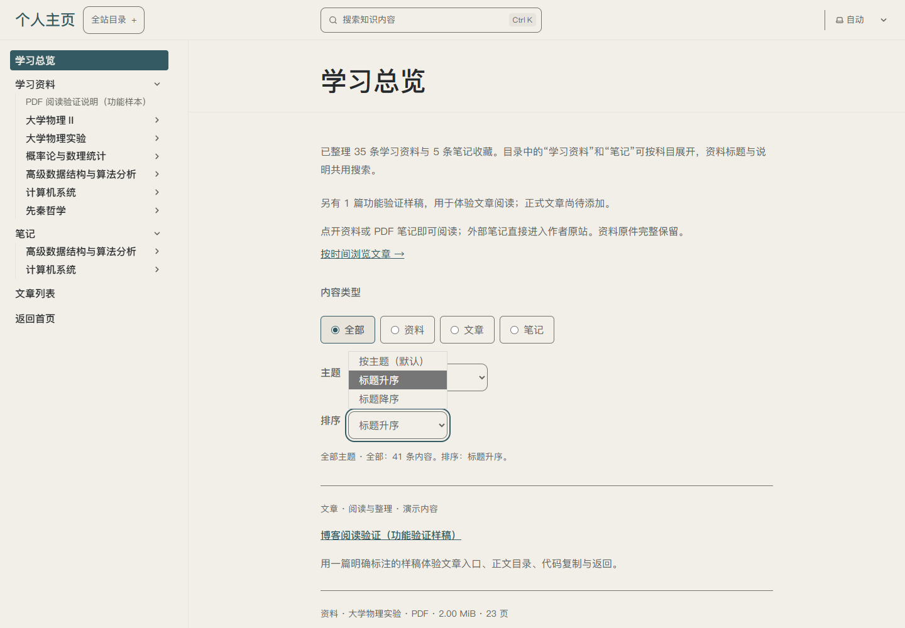
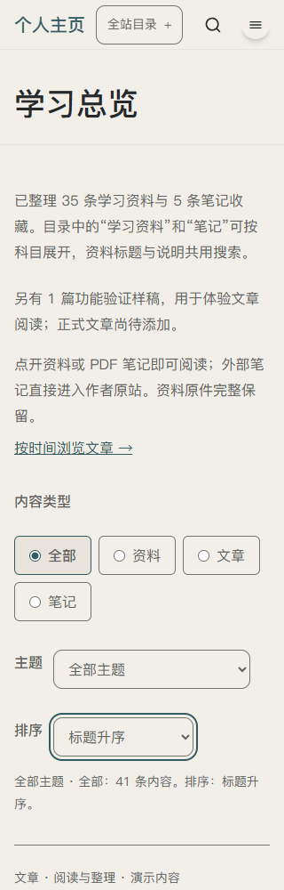

# U09/U14 · P03 · T07.04 标题排序

日期：2026-10-08；K01排序、K02反馈、K03/G04来源返回；R02/R09/R10/R12。单轮主要变量：现有统一列表可改变标题顺序。C03理解和C07可控；原生菜单与既有主题控件共用颜色、圆角、苹方优先字体与44px目标，无新主题/素材/动画。

## 结果与资源

三项选项明确表达默认主题顺序与标题升/降序；条件与排序同时保留，清空筛选只改筛选，选择默认恢复原顺序。中文章节数字自然排列，相同标题仍是独立条目。排序反馈与数量共用原有live区域；未知值和无脚本有真实说明。

复用原生select、已有样式、URL/history和T26.01来路返回；新增素材和依赖0。主技能ui-ux-pro-max定向查询Web键盘/焦点规则，未引入第二份设计系统，[清单](../REFERENCES.md#t0704-学习总览排序资源清单)。204种组合与当前16组/隔离17组Edge均通过；PDF返回5904→5904px与焦点保持，[工程证据](../../technical/iterations/t07-04-2026-10-08.md)。

## 实际截图

以下三份截图均实际查看。桌面展示原生菜单展开和选中/焦点状态，手机为320px，控件自动换行，正文不横向溢出。过渡页头和既有整页结构保持；新整体构图及品牌接入另轮验收。

## 用户体验和下一步

从[物理资料标题升序](http://127.0.0.1:4322/personal-homepage/knowledge/?type=resource&topic=%E5%A4%A7%E5%AD%A6%E7%89%A9%E7%90%86%E2%85%A1&sort=title-asc)试升/降序、清空、刷新和阅读返回。手机/键盘与200%文字已验，真机、屏幕阅读器和用户审美另验；U09/U14整体不提升。下一小步可处理总览长列表分页；网页真实上传仍待会话工具恢复或用户实际操作。
