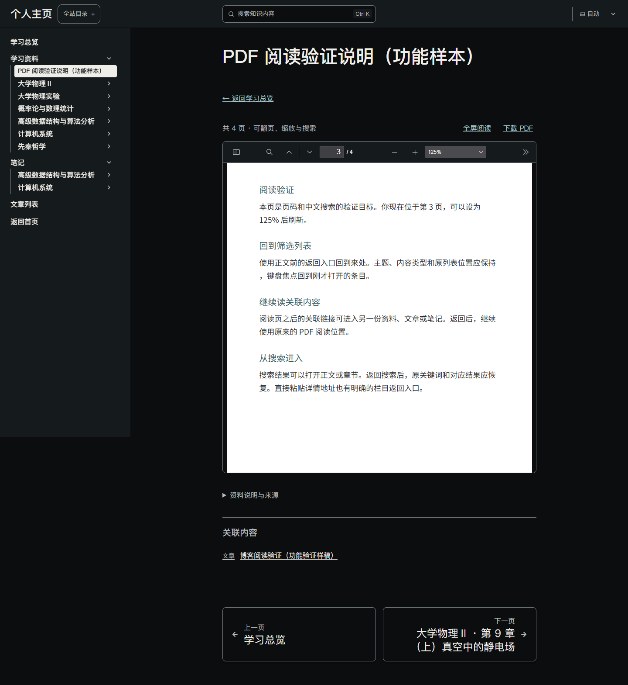
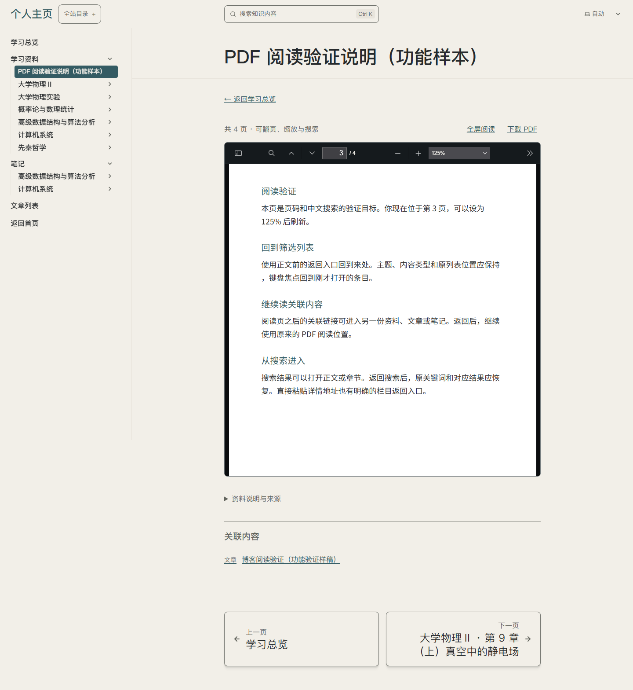
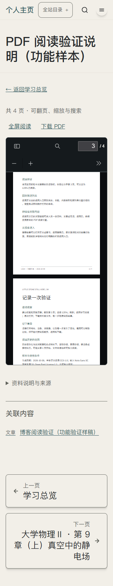

# U09 · P05 · T06.01 公开 PDF 样本

日期：2026-10-08；控件 K04-native、G04；技术任务 T06.01 / R02，P03 进入 P05。单轮主要变量：附件从本机副本变为随静态网站发布的公开文件。C03 理解和 C07 可控；沿用当前阅读框、来源折叠、来路返回、44px 操作与苹方优先页面字体，不引入新网页视觉主题。

## 资源与结果

PDF.js 6.4.299、原生 docs、现有主题和焦点状态均复用。新增一份明确标为功能样本的四页 PDF（正文 CC0），仅在该文件内嵌 Noto Sans SC OFL 子集；无网页字体、图片、图标或动效资产。[来源清单](../REFERENCES.md#t0601-公开-pdf-资源清单)、[具体文件/字体登记](../../../public/materials/README.md)。

改前本机 PDF 能读，但干净构建缺少附件；本轮干净快照没有任何本机 PDF，功能样本打开直接渲染，可阅读、下载和恢复原生页码/缩放。现有私人资料仍明确显示未接入，不伪装正式部署。四页文件逐页渲染查看通过；17 组 Edge 行为及 7 种错误附件拒绝见[工程记录](../../technical/iterations/t06-01-2026-10-08.md)。

## 实际截图

以下三份最新截图均实际查看：明暗使用第 3 页/125%，手机 320px 为适应页面宽度。采集前等待当前 canvas 完整渲染；放大时文档内部可滚动，外层不横向溢出。屏幕上的“个人主页”仍为既有过渡页头，首页和品牌接入由独立切片处理。

## 体验和下一步

从[资料／阅读与整理](http://127.0.0.1:4366/personal-homepage/knowledge/?type=resource&topic=%E9%98%85%E8%AF%BB%E4%B8%8E%E6%95%B4%E7%90%86)打开样本，改第 3 页/125%，刷新和返回，再核对文件下载。控件焦点与来源恢复执行者验证通过；用户审美/体验、真机触摸与屏幕阅读器尚未确认。下一份真实 PDF 需按具体公开范围和来源再接入，不把本轮功能样本当作课程内容完成。
