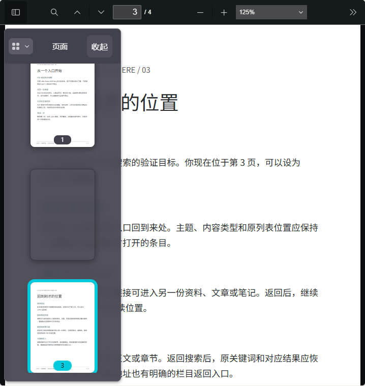
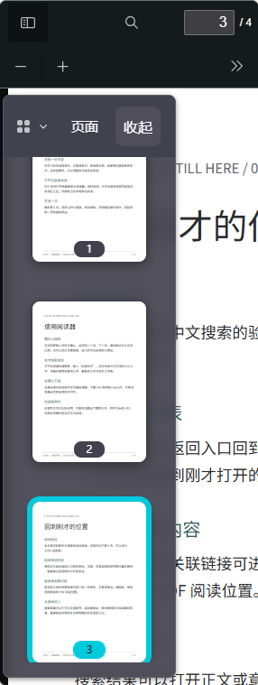
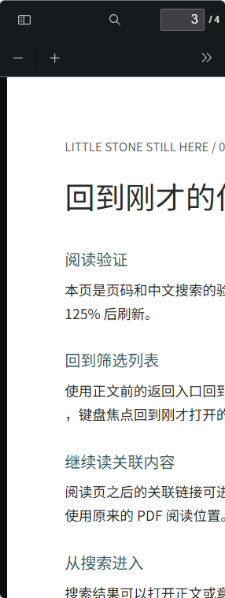

# U09 · P05/P06 · T08.02 PDF 侧栏收起

2026-10-08；K04-native / R02、R09、R12。单轮变量：在侧栏标题内提供可见关闭入口。C07可控、C03理解，操作发生处可以直接退出；其他阅读状态沿用PDF.js原生实现。

可见“收起”及中文可访问名称，实测50×44px；关闭焦点交回原生工具栏，可再次打开。Enter/Space/Esc及嵌套菜单先关闭通过；第3页/125%不受影响。[11组实际证据](../../technical/iterations/t08-02-2026-10-08.md)，用户体验待反馈。资源仅既有原生按钮与文字，新增字体、图标、图片、动效和依赖0。

以下截图均实际查看。使用CC0公开功能样本；手机保持用户选择的125%文档缩放，可平移正文，不新增强制缩放。

刷新当前页面后体验；原生左上开关仍负责打开/关闭，新增入口只补就近关闭。真机、屏幕阅读器与整体新构图留后续；本机控制工具权限任务独立验收。
