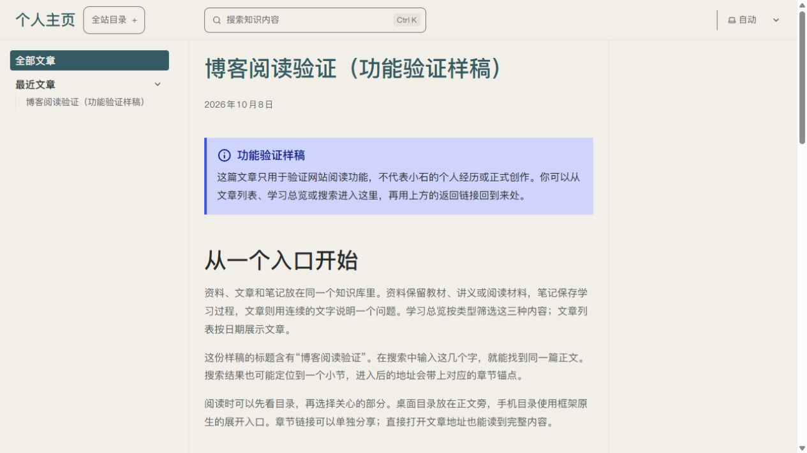
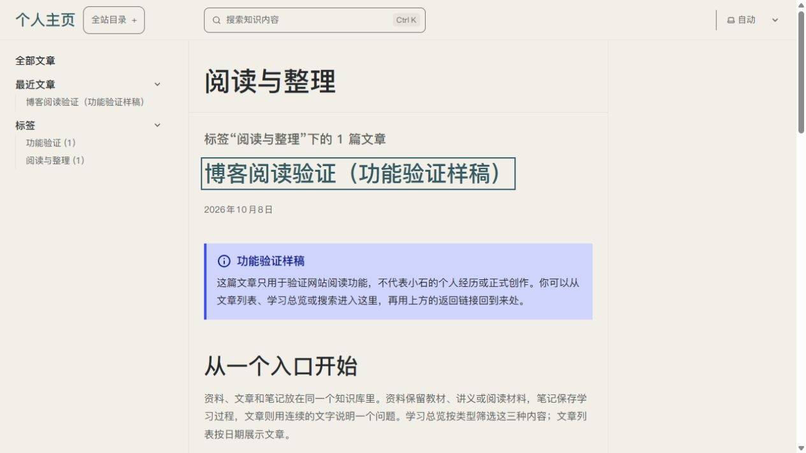

# U09/U13 · P06/P17 · T07.05 标签浏览开关

2026-10-10，唯一主要变量为站主是否启用博客标签浏览。依据用户最新指令及 P06/P17 规格，沿用 Pages CMS 原生 boolean、Save 和反馈；使用 ui-ux-pro-max 核查控制、明确标签和状态恢复。没有新美术、字体、控件库或动效，设计资源新增 0。

P17 左侧“博客设置”提供“启用标签浏览”，说明开/关效果、原始标签保留、Save 后构建发布的边界。实际托管两态保存/刷新、Space 切换和未改动时 Save 禁用通过。后台最终恢复开启，截图只留本机。

P06 关闭后侧栏、列表和正文标签全部消失，文章及搜索仍可读；旧标签来源刷新后回退文章列表，原标签地址为原生 404。重新开启恢复匹配文章、返回标签结果和原文章链接焦点。两态 production 及 HTTP 结果与[技术记录](../../technical/iterations/t07-05-2026-10-10.md)一致；实际查看下列截图。

执行者验证通过，用户体验待反馈。手机后台、读屏与正式部署另验，U09/U13 整体未完成。
