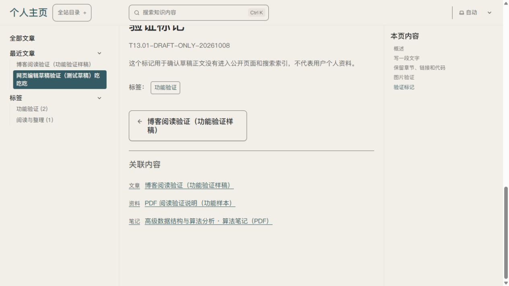
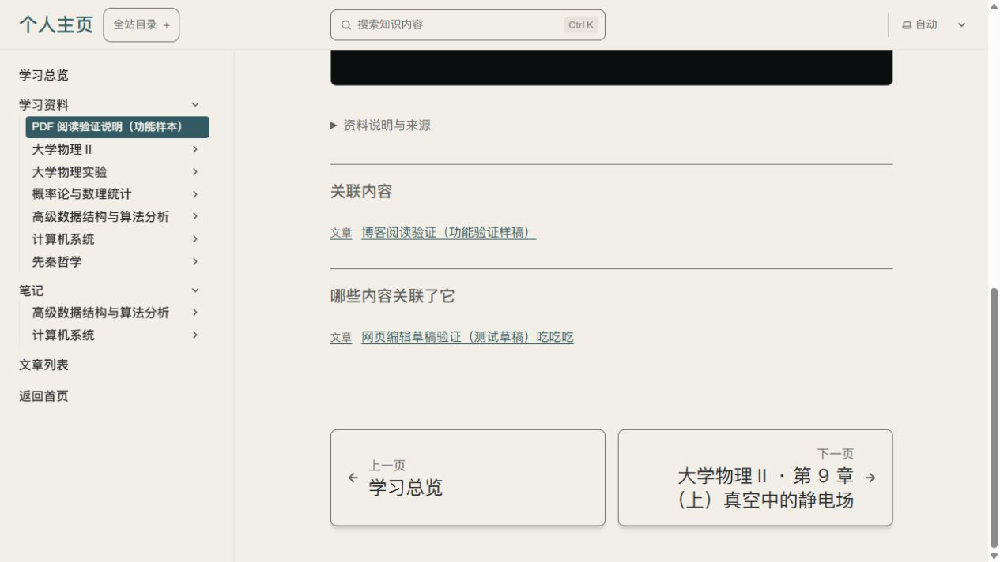

# U09/U13 · P17/P05/P06 · T13.11 关联内容选择

2026-10-10，唯一主要变量为站主写文章时选择已有内容。依据P17和既有K03关联列表，使用ui-ux-pro-max核查标题、类型、主题、选中反馈、×移除及保存重开；沿用Pages CMS原生控件和当前学习排版，设计素材新增0。

reference根目录实测无子目录条目，不计通过；改用原生select多选，41个已发布候选显示“类型 · 真实标题 · 主题”。搜索“算法”匹配3条，文章/资料/笔记三类选择真实保存并重开保持；两处表单的候选一致，固定稿最后恢复原单条关联。提示解释不要选自己、构建后生效、新内容需开发者同步。

前台普通关联与反向列表延续既有设计。以下截图来自真实保存的本机隔离候选，测试稿仅在候选中可见；仓库保持草稿，实际生产仍排除。两张已实际查看，详细证据见[技术记录](../../technical/iterations/t13-11-2026-10-10.md)。

核心选择/保存通过执行者验证，用户体验待反馈。后台截图只留本机；最后出现归属未知的未保存输入，已停止操作并保留。Esc/组合键未计通过，手机后台、读屏、自动候选同步和正式部署另验，整体U09/U13未完成。
