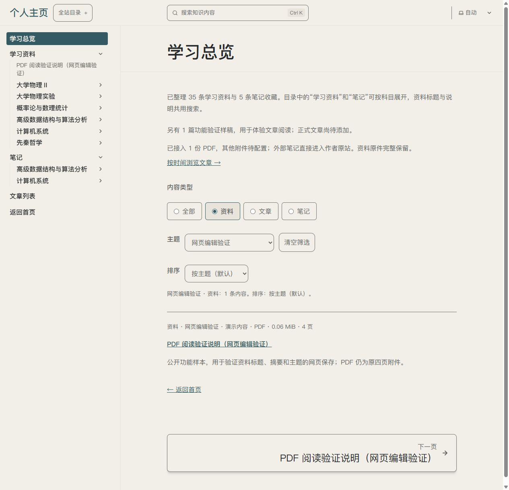

# U09/U13 · P17/P03/P05 · T13.12 资料说明编辑

唯一主要变量为已有资料的三个元数据字段。沿用ui-ux-pro-max的可见标签、保存反馈与重开核查；Pages CMS原生集合、子目录、文本字段、主题列表及Save覆盖需求。新增设计资源0，学习区样式未变。

## 实际体验

- “学习资料（说明编辑）”有六科目目录、根PDF功能样本及旧阅读样本，无新建入口。physics内第9章上下标题及三字段正确，课程内容未编辑。
- 功能样本标题/摘要/主题A→B，真实Save后独立重开B保留、Save禁用。说明实显先保存再离开、网站需构建发布、改标题/主题需同步候选。
- 总览资料+“网页编辑验证”实际匹配1条，新标题/摘要正确；首次发现样本侧栏固定旧标题，改用原生slug后H1/侧栏同名。
- PDF原4页直接呈现，中文可读；展开说明原正文/来源/关联保留。正文手写表格未随元数据改写，两者作用分别记录。
- B→A原生保存，开发者随后恢复排版。再开原值和说明正确、Save禁用；旧未知未保存编辑保留。成功Save后当前表单按钮可能仍可用，不称即时禁用或未落盘。

## 入口与证据

[后台](https://app.pagescms.org/0ne-small-stone/personal-homepage/codex%2Ft13-12-resource-editor/collection/resources)已恢复原值。后台截图仅留本机证据目录（t13-12-cms-saved.png / t13-12-cms-restored.png），含账号的界面图不提交仓库。

[冻结总览](http://127.0.0.1:4384/personal-homepage/knowledge/?type=resource&topic=%E7%BD%91%E9%A1%B5%E7%BC%96%E8%BE%91%E9%AA%8C%E8%AF%81)保留B效果；28fe07a保存内容与73508ed导航配置组成副本，不随新Save更新，不是正式部署。

实际浏览器截图同时呈现主题选择、列表结果及侧栏新名称。PDF4页及源信息另有实际DOM记录、文件指纹，[工程证据](../../technical/iterations/t13-12-2026-10-10.md)区分原生Save、同步与恢复。

## 状态

执行者局部验证通过，用户体验待反馈。手机/读屏、笔记编辑、自动同步及部署另片；下一片补已有笔记入口，不将此片记为U13整体完成。
