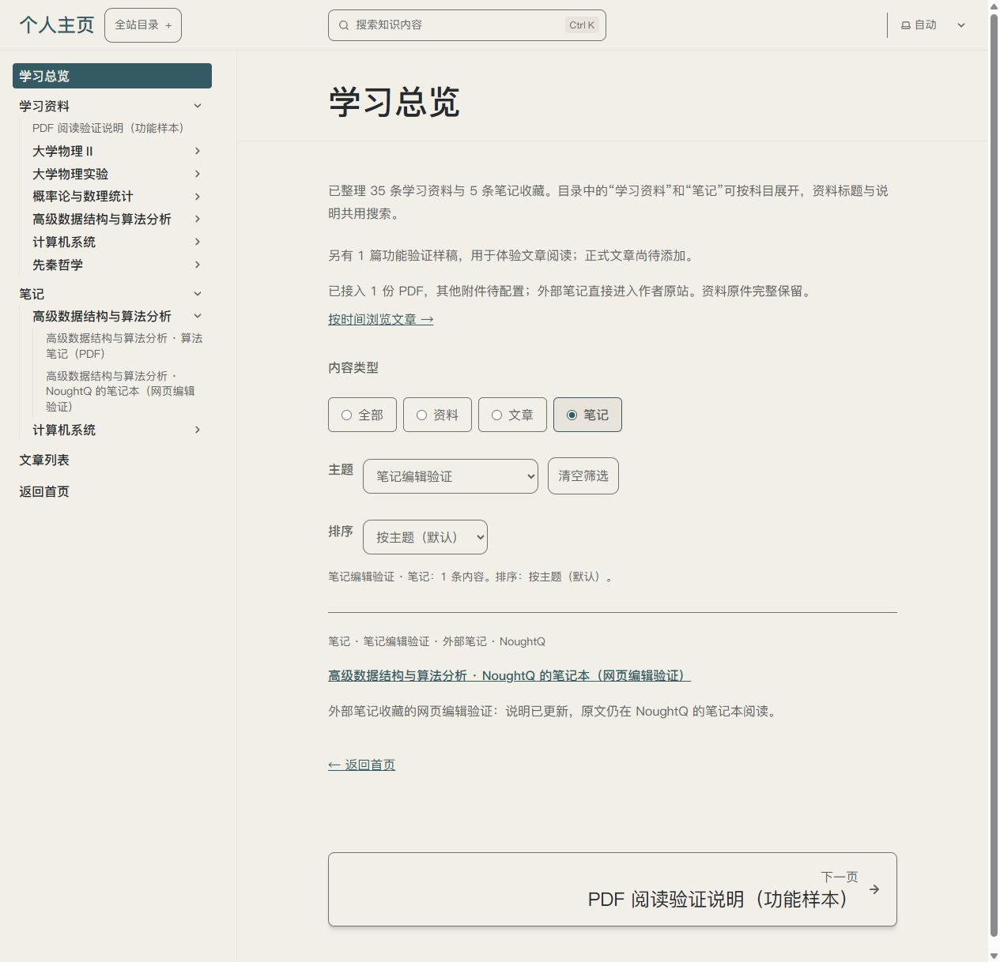

# U09/U13 · P17/P03/P05 · T13.13 笔记收藏说明编辑

唯一变量为既有笔记的说明编辑。沿用ui-ux-pro-max的标签、保存反馈和重开核查；复用Pages CMS原生集合/科目目录/三个字段。当前笔记5条为PDF或外站收藏，编辑本站标题/摘要/主题，原阅读入口继续读原文；新建/正文编辑另片，素材新增0。

## 实际体验

后台根目录1条草稿演示、ads/computer-systems两个目录，无新建入口。ads内两条笔记正确，PDF三字段预填、Save禁用，未更改；外部收藏B标题/摘要/主题真实Save、独立重开保留，说明解释编辑范围、保存/发布及候选同步。作者/原站地址/源信息和正文保留；当前表单Save即时禁用不作为成功条件。

前台笔记+“笔记编辑验证”匹配1条，新标题/摘要/主题及作者NoughtQ同时呈现；展开笔记的ADS侧栏，新标题同步。实际点击到原站课程目录，返回后条件与1条结果保留。外站可达只记录当次结果。

原生表单恢复A后开发者恢复排版，全部内容及PDF回到基线；再开原值正确、说明实显、Save禁用。后台账号截图仅存本机本轮证据目录（t13-13-cms-saved.png / t13-13-cms-restored.png），不提交仓库。

## 验收入口与截图

[笔记后台](https://app.pagescms.org/0ne-small-stone/personal-homepage/codex%2Ft13-13-note-editor/collection/notes)已恢复；[B冻结快照](http://127.0.0.1:4385/personal-homepage/knowledge/?type=note&topic=%E7%AC%94%E8%AE%B0%E7%BC%96%E8%BE%91%E9%AA%8C%E8%AF%81)来自e201f34，不随新Save更新，不是正式部署。

截图来自实际浏览器并已目视复核。[工程记录](../../technical/iterations/t13-13-2026-10-10.md)分别保留原生保存、候选过期失败、同步CI取消及最终恢复成功，不称全部历史CI全绿。

## 状态

本片执行者验证通过，用户体验待反馈，U13整体未完成。笔记新建/正文编辑、自动同步、手机/读屏及部署另片；新增素材/依赖0。
