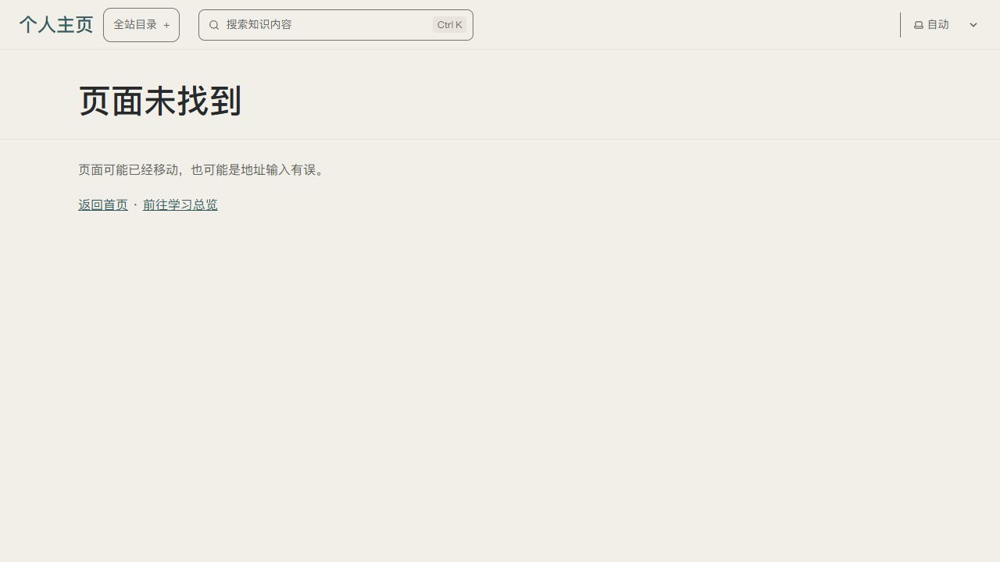
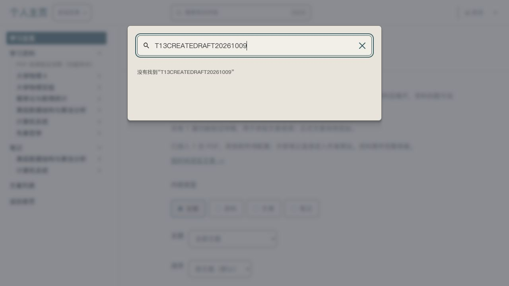

# U13 · P17 · T13.04 原生文章列表与新建

2026-10-09 第 1 轮。P17、P06 / R10、R13 / U13 / T13.04。执行者验证通过，用户体验待反馈。唯一主要变量是从固定文章编辑进入同目录的原生列表与新建；后台继续复用 Pages CMS，不另设主题或新控件。

## 依据与资源

遵循设计 SPEC 的 P17 与既有后台交互边界，前台学习排版沿用 SYSTEM 的苹方优先栈。本轮 ui-ux-pro-max 用于必填提示、错误焦点、默认状态与保存后反馈检查。成熟原生集合已覆盖目标，无需新增图片、字体、图标、动效或素材；源码/原生字段核验由[技术记录](../../technical/iterations/t13-04-2026-10-09.md)承接。

## 实际状态

| 状态 | 可见结果 |
| --- | --- |
| 文章列表 | 标题、draft、date 原生三列，初始三篇，真实创建后四篇；日期降序 |
| 新建默认 | 草稿开启，日期 2026-10-09；中文标题、摘要、地址标识及正文标签 |
| 空输入 | 原生四项错误与保存阻止，焦点到标题 |
| 非法标识 | 中文格式提示，保存阻止，焦点到地址标识 |
| 保存 | 成功进入编辑页；刷新后字段和 Markdown 保留，Source/Editor 能切换 |
| 重开与修改 | 返回“文章”列表，点击标题重开；修改标题后保存，刷新新标题保持、地址与 ID 保持 |
| 列表搜索 | Search entries... 输入“网页新建”，仅新草稿一行；清空恢复四行 |
| 生产排除 | 新稿直达“页面未找到”；总览仍 41 条，搜索独有正文标记没有结果 |

原生英文 Add an entry、Save、Source/Editor、Search entries... 仍存在，不称后台全中文已完成。地址标识可编辑，字段文案要求保持，不称只读保证；本轮没有更改原生字段布局。没有完成手机后台、取消离开和网络失败恢复验收。

## 实际截图与证据

后台真实列表及重开截图保存于本机本聊天的可视化目录：`t13-04-cms-list-final-2026-10-09.png`、`t13-04-cms-restored-2026-10-09.png`。两张均已实际查看，界面含账号信息，不纳入公开仓库。图中新增标题与真实提交对应；最终交付展示后台列表供用户核验。

公开前台截图均已实际查看，来自真实 CMS 内容提交的 4374 生产快照：

## 复现与下一步

[后台文章列表](https://app.pagescms.org/0ne-small-stone/personal-homepage/codex%2Ft13-04-article-collection/collection/articles)新建 → Save → 刷新 → 返回列表 → 重开 → 改标题保存；[生产总览](http://127.0.0.1:4374/personal-homepage/knowledge/)搜索 `T13CREATEDRAFT20261009` 无结果。[完整步骤](../../technical/CMS_WORKFLOW.md#t1304-文章列表与新建草稿)。

下一片核验未保存离开/取消及错误恢复，保持一轮一个主要变量。用户体验反馈另收，U13 整体、正式部署与新首页设计没有因此提升状态。
