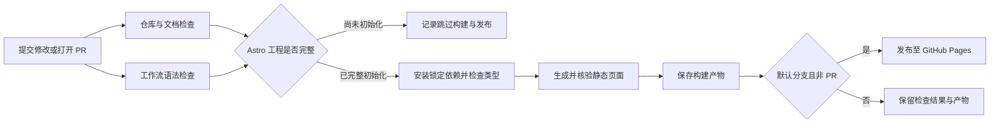

# GitHub 工作流说明

更新：2026-10-07。发布目标已由用户选择为 GitHub Pages；公开仓库 [0ne-small-stone/personal-homepage](https://github.com/0ne-small-stone/personal-homepage) 已创建并上传。仓库与工作流语法检查已在 GitHub 通过，Pages 来源与 main 保护已应用并读回；Astro 基础工程已建立并通过本地类型与生产构建，远程网站检查以技术 PLAN 的证据为准，网站尚未上线。

账号连接已完成：2026-10-07 通过 GitHub 连接读取个人资料与实际登录身份，均核对为 `0ne-small-stone`；本机 Git Credential Manager 凭证也通过官方 API 核对同一身份，可用于 Git 推送与仓库管理。插件的仓库 App 安装列表尚未返回目标账号；仅该插件的仓库能力需补充授权，不阻止本次通过 Git 和官方 API 接入。凭证只在进程内使用，不写入仓库。

## 日常工作如何流转



修改推送到 `main`、面向 `main` 的 Pull Request，以及 Actions 页手动执行，都会触发同一个主工作流。PR 检查修改是否可合入；默认分支的成功构建用于发布。任何前置检查失败都会阻止后续构建或部署。

根目录已加入完整 Astro 工程，工程状态判断返回就绪，现有流程会执行 Astro build，无需新增另一套发布流程；缺锁文件或缺命令仍会直接报错。PR 只构建和保存产物，正式部署由合并后的默认分支执行。

## 各文件负责什么

| 文件 | 作用 |
| --- | --- |
| [site.yml](../../.github/workflows/site.yml) | 主流程，定义触发条件、检查、构建、产物上传和 Pages 部署依赖 |
| [dependabot.yml](../../.github/dependabot.yml) | 每周检查 Actions、根网站依赖和校验工具更新，通过 PR 提议更新；检查通过后再合并 |
| [.gitignore](../../.gitignore) | 排除本地原始资料、依赖目录、生成文件和环境配置；不会删除本地文件 |
| [.gitattributes](../../.gitattributes) | 统一文本换行，减少 Windows 与 Linux 之间的无关差异 |
| [.node-version](../../.node-version) | 指定 Node.js 24，工作流读取该文件；本地也使用这个版本 |
| [校验工具包](../../tools/ci/package.json)与[锁文件](../../tools/ci/package-lock.json) | 独立保存 CI 工具依赖；与根目录的网站依赖分开；`npm ci` 按锁文件安装 |
| [files.mjs](../../tools/ci/files.mjs) | 通过 Git 文件清单检查原始资料、环境配置、符号链接与超过项目上限的文件 |
| [docs.mjs](../../tools/ci/docs.mjs) | 配置 remark、GFM 和链接插件，检查本地文件及跨文档章节锚点；不改写 Markdown |
| [project.mjs](../../tools/ci/project.mjs) | 判断网站是否初始化；给后续 job 输出 `app_ready`，并在 Actions 摘要说明跳过或就绪状态 |
| [dist.mjs](../../tools/ci/dist.mjs) | 检查首页产物存在、未混入本地原始资料及配置/密钥文件，然后允许上传 |
| [checks.test.mjs](../../tools/ci/checks.test.mjs) | 用临时样本验证缺工程、坏链接、空产物和误纳入资料时确实会被拦住 |

## 主工作流的四个 job

| job | 执行内容 | 当前状态 |
| --- | --- | --- |
| Repository checks | checkout → Node → 安装校验工具 → 文件和文档检查 → 测试 → 工程状态判断 | 本地与首轮 GitHub Actions 均通过 |
| Workflow syntax | 使用 actionlint 官方容器检查 YAML、Actions 表达式和 job 依赖 | 本地便携工具与首轮 GitHub 官方容器检查均通过 |
| Astro build | 安装网站依赖 → `npm run check` → `npm run build` → 核验 `dist/` → 上传 Pages 产物 | 本地与 PR #2 的首次远程构建均通过，现为必需检查 |
| Deploy to GitHub Pages | 获取当前成功构建的产物，通过官方 deploy-pages 发布，返回实际站点地址 | Pages 来源已配置；等待网站工程和成功构建，首轮跳过，尚未发布 |

构建使用官方 checkout、setup-node、upload-pages-artifact；部署使用 deploy-pages。Actions 固定到已核对的提交 SHA，由 Dependabot 维护更新。主流程只授予仓库读取权限；部署 job 单独获得 `pages: write` 和 `id-token: write`。PR 不执行部署。

PR 的新修改会取消旧的同 PR 检查；正式分支的流程按并发组排队，部署过程中不会被新提交直接取消。Pages 构建产物保留 7 天，可以在 Actions 运行详情中下载核验；网站工程尚未创建时不会产生站点产物。

## 本地如何执行同样的检查

在项目根目录使用 Node.js 24：

```powershell
npm ci --prefix tools/ci --ignore-scripts --no-audit --no-fund
npm --prefix tools/ci run check
npm --prefix tools/ci test
node tools/ci/project.mjs
npm ci --no-audit --no-fund
npm run check
npm run build
node tools/ci/dist.mjs
```

工作流语法可用 actionlint 检查：

```powershell
actionlint .github/workflows/site.yml
```

本次下载的便携工具位于被忽略的 `.local-tools/actionlint/`，在这台电脑可使用 `./.local-tools/actionlint/actionlint.exe`。这个目录不会上传，GitHub runner 使用官方容器。

文件纳入策略属于本项目约束：单个 Git 文件最多 50 MiB，静态产物总量最多 900 MiB；它们为版本管理和 Pages 容量预留余量，不是两个平台的统一硬限制。原始资料目录完全保留在本地，发布资料时再选择允许公开且尺寸合适的派生文件或外部地址。文件名规则只能拦截已列出的配置和密钥文件，不能代替正式发布前的内容审查。

## 网站工程接入条件

根目录须包含 `package.json`、`package-lock.json`、`astro.config.*`、`src/`；依赖中声明 Astro，并提供 `dev`、`check`、`build`、`preview` 四个真实命令。`check` 应运行 Astro/TypeScript 检查，`build` 应生成静态 `dist/`。

按拟用仓库名，Astro 配置需要以下发布路径；仓库名或域名变更时同步修改：

```js
import { defineConfig } from 'astro/config';

export default defineConfig({
  output: 'static',
  site: 'https://0ne-small-stone.github.io',
  base: '/personal-homepage',
});
```

站内链接、素材路径和搜索资源应适配 `base`，实施时核验深层地址、刷新、404 和 Pagefind。知识库及 CMS 接入后，内容字段、草稿排除、资源派生与关系索引校验加入现有原生构建流程。

## GitHub 端配置与后续接入

1. 公开仓库已创建。GitHub Free 的 Pages 需要公开仓库；公开仓库中的代码和文档也能被任何人读取。[GitHub Pages 使用条件](https://docs.github.com/en/pages/getting-started-with-github-pages/about-github-pages)
2. 已将 32 个允许公开的文件提交到 `main`，本地 origin 已连接实际地址。Git 文件清单排除原始学习资料及本地依赖。
3. Pages 的 Source 已通过官方 API 设为 `GitHub Actions` 并读回为 `workflow`。网站工程完成后，主流程才会执行实际部署。[Astro 官方部署说明](https://docs.astro.build/en/guides/deploy/github/)
4. [首轮运行](https://github.com/0ne-small-stone/personal-homepage/actions/runs/37596208177)成功后已启用 main 保护；Astro 工程的 [首次 PR 构建](https://github.com/0ne-small-stone/personal-homepage/actions/runs/37598839477) 成功后，必需检查现为 `Repository checks`、`Workflow syntax`、`Astro build`，均绑定实际 GitHub Actions App。设置应用和读回结果见技术计划。

Giscus 授权、CMS 字段、音乐同步与 AI 服务仍由各自技术任务实现。这些服务不因 CI 文件创建而自动接入，也不在本次工作流中使用它们的凭证。
