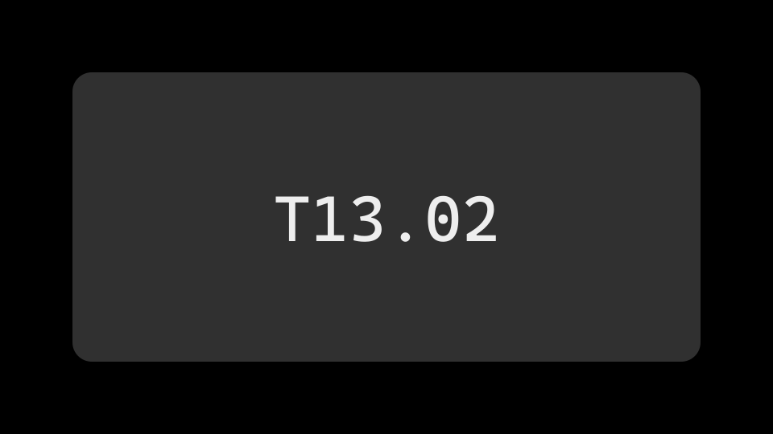

这是一篇用于网页编辑验证的测试草稿，不是正式文章。保存草稿后，它仍不会出现在公开网站的文章列表、学习总览或搜索中。

## 写一段文字

可以在网页后台修改标题、摘要或这一段文字，然后保存。重新打开后台时，应该能看到保存后的内容，并在仓库中找到对应的提交记录。

## 保留章节、链接和代码

- 正文以 Markdown 保存。
- [已发布的阅读功能样稿](../article-reading-check/)保持原有地址。
- 此稿保持草稿；图片用于本轮验证，发布另行验证。

```js
const draft = true;
console.log('仍是草稿', draft);
```

## 图片验证



图片说明：这张功能样本通过 Pages CMS 媒体库上传，正文保存后重新打开核对。

## 验证标记

T13.01-DRAFT-ONLY-20261008

这个标记用于确认草稿正文没有进入公开页面和搜索索引，不代表用户个人资料。

## 正文链接验证

T13LINK20261009

[阅读功能样稿（链接测试）](../article-reading-check/)

[Pages CMS 富文本说明（链接测试）](https://pagescms.org/docs/configuration/fields/rich-text/)